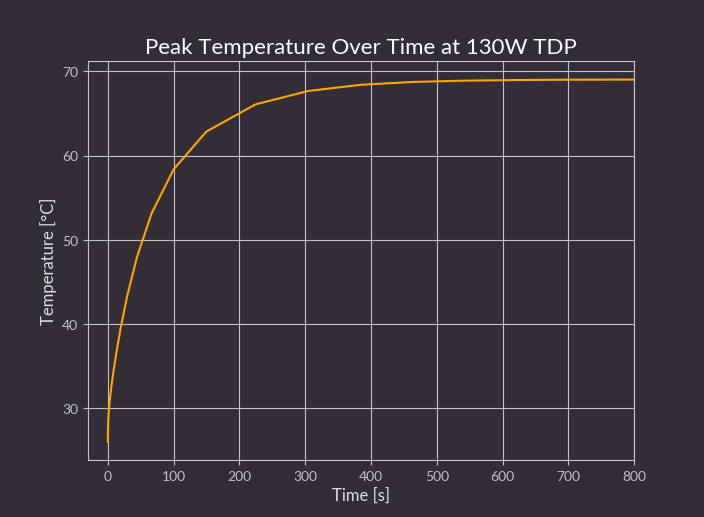

# Jetson AGX Thor Baseboard enclosure

Copyright (c) 2026 [Antmicro](https://www.antmicro.com)

## Overview

This repository contains open hardware design files for the Jetson AGX Thor Baseboard enclosure.

This black-anodized aluminum enclosure ensures optimal thermal performance when used with DC blowers.
The design files are optimized for compatibility with most CNC prototyping services.
The design files are provided in the STEP format.

## Repository structure

The project files are stored in the following directories:

* ``step`` - contains STEP files of the CNC-manufacturable parts and additional components needed to assemble the enclosure
* ``blend`` - contains .blend files derived from the STEP files
* ``drawings`` - contains mechanical drawings of the CNC-manufacturable parts in PDF format
* ``img`` - contains graphics for this README
* ``bom`` - contains the bill of materials

## Key features

* Active cooling design
* Modular and stackable
* Fits 2.5U in a 19" rack cabinet mounted horizontally in two rows or vertically in one row (up to 8 units)

## Mechanical outline

The graphic below presents the mechanical outline of the enclosure, along with the overall dimensions.

## Thermal performance 

Analysis of the thermal solution:

* **Peak Temperature**: 69.2°C (Thor Module TTP to radiator interface)
* **Thermal Resistance 𝜃pa**: 0.34°C/W

The Jetson AGX Thor Baseboard enclosure meets the thermal management requirements specified in the [official NVIDIA documentation](https://developer.nvidia.com/downloads/assets/embedded/secure/jetson/thor/docs/jetson_thor_thermal_dg_tdg12271001.pdf).

## License

This project is published under the [Apache-2.0](LICENSE) license.
