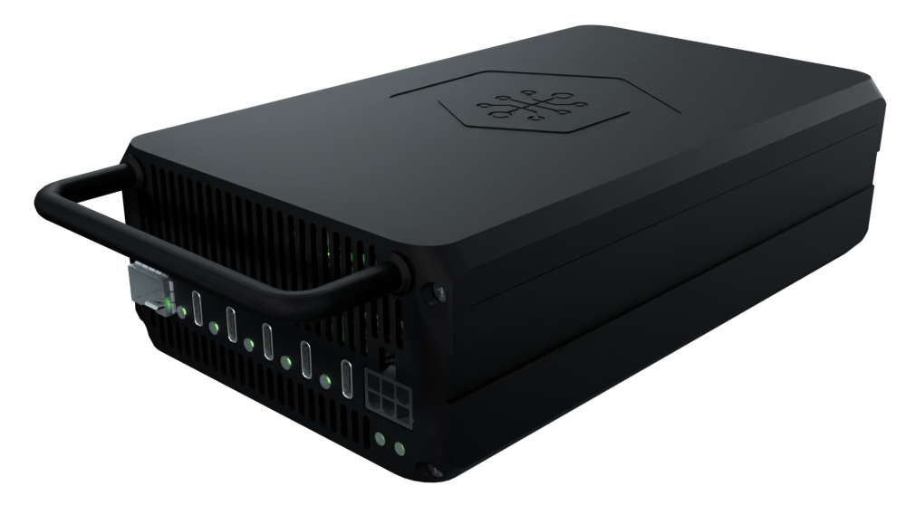
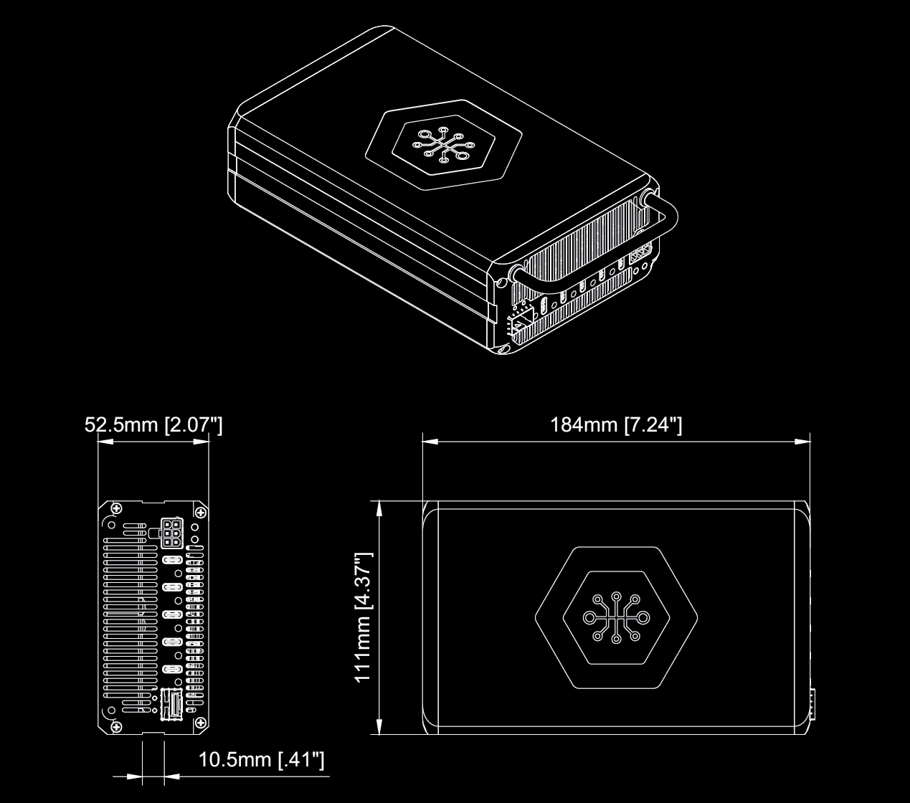

# Antmicro Baseboard for NVIDIA® Jetson AGX Thor™ enclosure

Copyright (c) 2026 [Antmicro](https://www.antmicro.com)

## Overview

This repository contains open hardware design files for the Antmicro Baseboard for NVIDIA® Jetson AGX Thor™ enclosure.

This black-anodized aluminum enclosure ensures optimal thermal performance when used with DC blowers.
The design files are optimized for compatibility with most CNC prototyping services.
The design files are provided in the STEP format.

## Repository structure

The project files are stored in the following directories:

* ``step`` - contains STEP files of the CNC-manufacturable parts and additional components needed to assemble the enclosure
* ``blend`` - contains .blend files derived from the STEP files
* ``drawings`` - contains mechanical drawings of the CNC-manufacturable parts in PDF format
* ``img`` - contains graphics for this README
* ``bom`` - contains the bill of materials

## Key features

* Active cooling design
* Modular and stackable
* Fits 2.5U in a 19" rack cabinet mounted horizontally in two rows or vertically in one row (up to 8 units)

## Mechanical outline

The graphic below presents the mechanical outline of the enclosure, along with the overall dimensions.

## Thermal performance 

The thermal performance of the cooling solution under a 130W load (the maximum SoM TDP) was analyzed using CFD simulation.

### Simulation geometries
* Antmicro Baseboard for NVIDIA® Jetson AGX Thor™ enclosure
* [Heatsink](./step/Thor_Heatsink.step)
* NVIDIA® Jetson AGX Thor™ SoM TTP (Thermal Transfer Plate)
* Antmicro Baseboard for NVIDIA® Jetson AGX Thor™
* 2x Blower type fan - Sunon EF50151BX-1B000-A99
* [Shroud](./step/shroud_EF50151BX-1B00U-A99.step)

### Materials constraints
* NVIDIA® Jetson AGX Thor™ SoM TTP: aluminum
* Antmicro Baseboard for NVIDIA® Jetson AGX Thor™ enclosure: aluminum
* [Heatsink](./step/Thor_Heatsink.step): copper

### Simulation constraints
* Ambient temperature of 23°C
* 130W heat source applied to the NVIDIA® Jetson AGX Thor™ SoM TTP
* Flow rate source adaptive to the performance curve derived from the [manufacturer's documentation](https://www.tme.eu/Document/c6d686cda46ac43be5a79f802eb95b53/Product+11.pdf)

### Simulation results

**Peak Temperature**: 74°C (NVIDIA® Jetson AGX Thor™ SoM TTP to heatsink interface) 

The simulation confirms that the designed thermal solution meets the thermal management requirements specified in the [NVIDIA® Jetson Thor Series Modules Thermal Design Guide](https://developer.nvidia.com/downloads/assets/embedded/secure/jetson/thor/docs/jetson_thor_thermal_dg_tdg12271001.pdf).

## License

This project is published under the [Apache-2.0](LICENSE) license.
